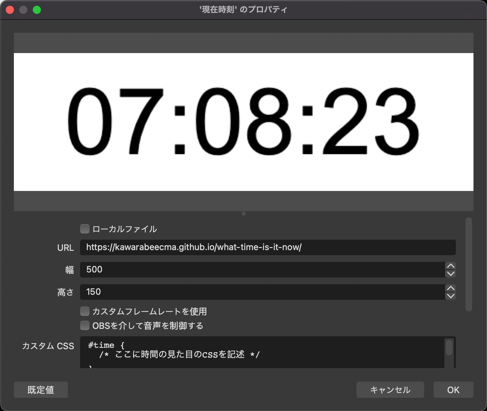

# OBS向け現在時刻

Displays the current time.

現在時刻を表示するだけのページです。

<https://heppokofrontend.github.io/obs-what-time-is-it-now/>

## OBSに乗せる方法

1. OBSのソースに「ブラウザ」を追加する
2. 「現在時刻」などをソース名にする
3. プロパティを設定する
    - 「URL」に「<https://heppokofrontend.github.io/obs-what-time-is-it-now/>」を入力する
    - 「幅」に「500」と入力する
    - 「高さ」に「150」と入力する
    - 「カスタムCSS」に任意のCSSを記述する
4. 「OK」を押す

## 免責事項

- 当該ページを利用したことによって生じた損害等の一切の責任を負いかねます
- 月のアクセス上限があるので、GitHubアカウントをお持ちの方はforkしてから使っていただけるとうれしいです
    - [GitHub Pagesのガイドライン](https://docs.github.com/ja/pages/getting-started-with-github-pages/about-github-pages)
    - デプロイするには`yarn deploy`コマンドを利用します
    - GitHub Pages1へのデプロイは`gh-pages`ブランチのルートを前提にしています
